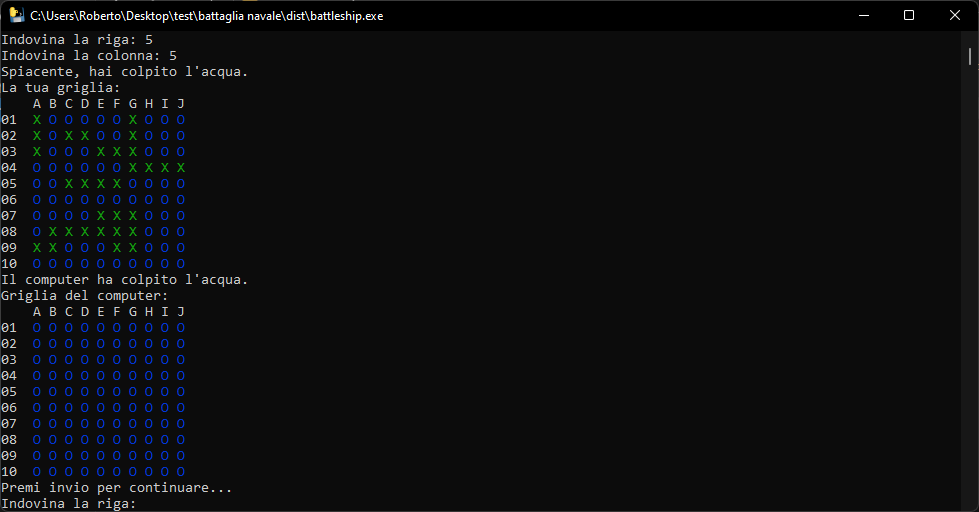
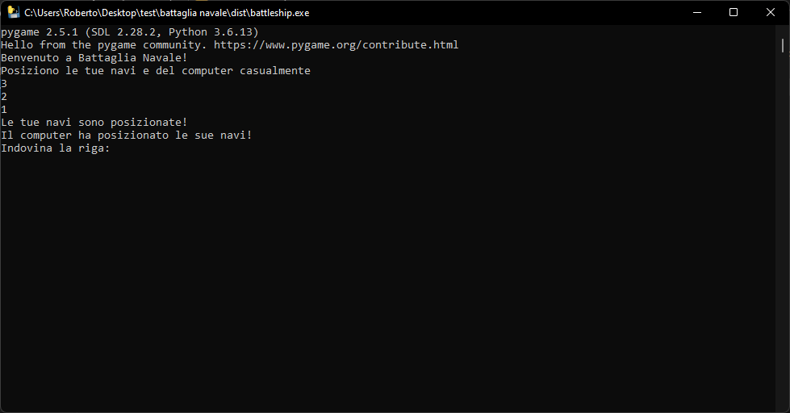

# Battle ship

Battleship was my first game written in Python, in which you can play against the computer.

## What does it do?

The game randomly places player and computer ships. The computer memorizes its last move!

## What is needed?

conda env create -f environment.yaml
pip install -r requirement.txt

## Usage

python battaglia navale2.py

## Example

## Contributing
Contributions are welcome! Feel free to submit a pull request.
